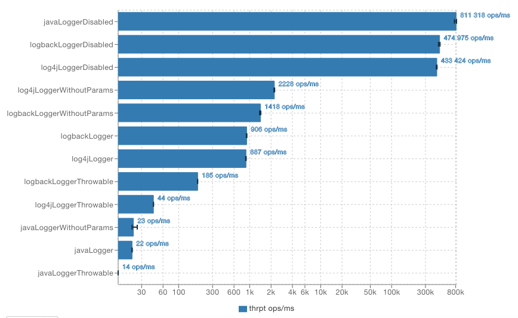

# Java Logging Benchmark

A simple benchmark of some Java logging libraries.

## Introduction

The purpose of this project is to benchmark the most popular Java logging libraries.
Logging is one of the most important parts of modern software, 
as it allows to easily track the significant ongoing processes in a running piece of software.

If logging is done well enough, it usually provides enough information to reproduce or fix a bug without excessive debugging.
Apart from debugging, logging serves other purposes:
* usage statistics and analytics,
* system auditing,
* resource monitoring.

However, logging is a tool that is required depending on context and current needs.
Administrators should be free to opt out of some logs if they serve no significant purpose,
and they should be able to control how detailed the messages should be.

Because of this, logging should not be a bottleneck of a production grade system.
It should be able to provide as much information as it can possibly provide depending on a context,
and it should not have any negative impact on any algorithms and logic.

## Logger Transparency

Logging should be as transparent as possible to ensure that it does not cause any performance or stability issues in the long run.
If logging is causing any side effects or issues, 
it is likely that some programmers will decide not to log some events to avoid such problems.

Logging usually proves to be a useful tool if used well. 
Even some less descriptive messages might give a lot of context to the internal processes of a system, 
but it should be easy to filter them out.
Too many messages might cause "information noise", which impacts the readability and usefulness of logs.

If the logs cannot be effectively filtered and are unreadable, then some people decide to turn them off,
which defeats the purpose of logs in the first place.
It is also necessary to organize logging in a way that it is easy to filter logs or spot important events 
(e.g. severe errors or data inconsistency).

This project, however, does not aim to show all good practices of how to implement logging.
The purpose of this project is to show data that can help with the decision of choosing a logging library.
As logging should be as transparent as possible, the impact on performance is very important.

## Overview of Java Logging Libraries

The most commonly used libraries for logging in Java are Logback and Log4j. 
Both are usually used with Slf4j, which is an API for logging that allows to easily switch between implementations that handle logging.
For example, thanks to Slf4j, it is very easy to switch between Logback, Log4j and JUL (Java Util Logging) without major code changes. 

This project includes benchmarks for the following libraries:
* Java Util Logging (JUL) - it is the standard logging library of Java.
  It is included with every Java release since JDK 1.4.
  Despite being a logging mechanism provided by a standard library, it is not popular and used very rarely.
* [Logback](https://logback.qos.ch/) - the project page says that "Logback is intended as a successor to the popular log4j project".
  It is actually a bit different from current Log4j release, albeit shares some similarities with it.
  Overall Logback is a very popular choice and is more flexible than JUL, but no new stable release has been published for 4 years 
  (as of 2021-06-24 the latest stable is 1.2.3, published in Mar, 2017).
* [Log4j 2](https://logging.apache.org/log4j/2.x/) - it is an Apache project, which is an improved version of Log4j. 
  This is a library that is actually more mature than Logback, because of the longer development history.
  It is also very configurable and commonly used. 
  The another benefit is that it is still actively maintained (as of 2021-06-24 there were 3 releases in the past year).

## The Benchmark Setup

This benchmark was prepared to measure how fast the logging is. 
It contains the typical use cases:
* logging a message without any parameters,
* logging a message with parameters,
* logging an exception.

To reduce side effects caused by IO which can affect the results, 
the loggers are configured to use a custom OutputStream that does nothing.
This OutputStream is called *BlackholeOutputStream* and is written in a way 
that it satisfies the following needs:
* it does not do any IO,
* it does not any CPU or memory intensive operations,
* it does not block or slow down any thread,
* JIT compiler doesn't see it as dead code.

If the first three requirements are not satisfied, 
then the results would be worse not because of how the libraries work, 
but because of this OutputStream, which is not the subject of our benchmark.

The last requirement is important as if the OutputStream did not actually do anything,
then the JIT compiler would notice that after a few iterations of `write` method.
It would mark this as *dead code* and skip whole call stack in the future iterations 
as running code that does nothing and has no side effects is redundant. 
This means that the results would be better than the actual performance of a logging library.

To run and measure the logging performance, a framework named [Java Microbenchmark Harness (JMH)](https://github.com/openjdk/jmh) was used.
This project builds a fat jar that can be run independently. 
It is important to run this as a standalone app, 
as this allows to stop any redundant background programs and processes which may affect the available resources of the machine
and affect the results.

Each library has 4 following benchmarks:
* logging a simple message (`...LoggerWithoutParams`) - tests how the library performs when appending a message to an OutputStream without the need to parse the message,
* logging a message with parameter evaluation (`...Logger`) - tests how the library performs when parsing a message and replacing placeholders with values,
* logging a throwable (`...LoggerThrowable`) - tests how the library performs when formatting a stack trace,
* logging with a disabled logging level (`...LoggerDisabled`) - tests how the library performs when there is no need to log the message 
  (i.e. minimum level is INFO, but message was logged with TRACE or FINEST level).

## The Results

The benchmarks were run on a MacBookPro8,2 with Intel(R) Core(TM) i7-2720QM CPU @ 2.20GHz, 16 GB of RAM and Java 11.
Results may vary between runs and between different machines and current run environment.

```
java --version
java 11.0.10 2021-01-19 LTS
Java(TM) SE Runtime Environment 18.9 (build 11.0.10+8-LTS-162)
Java HotSpot(TM) 64-Bit Server VM 18.9 (build 11.0.10+8-LTS-162, mixed mode)
```

Results of the benchmarks were saved as JSON and TXT files, 
where the JSON files were generated by JMH and TXT files contain the program output.
The files are available in the [results](results) directory of this repository.

JSON results can be visualized with [JMH Visualizer](https://jmh.morethan.io/). 
Thanks to this tool, we can see the throughput summary as the following bar chart.



What is the most noticeable is the fact that all 3 libraries performed very well 
when a message was logged with a level lower than the minimum configured level (the `...LoggerDisabled` benchmarks).
Number in the range of 433k-812k ops/ms suggest that the code was optimized by JIT compiler - using the aforementioned dead code elimination mechanism.

The effects of dead code elimination mechanism can be seen by comparing the performance of loggers during the warmups -
it was less stable as JIT compiler was "learning" what code is redundant. 
First iteration may be slower, as some invocations are not optimized yet 
and later warmups are faster as dead code elimination was applied.

```text
# Benchmark: io.github.multicatch.LoggerBenchmark.javaLoggerDisabled

# Run progress: 8,33% complete, ETA 00:27:41
# Fork: 1 of 1
# Warmup Iteration   1: 737907,992 ops/ms
# Warmup Iteration   2: 811645,680 ops/ms
# Warmup Iteration   3: 810355,901 ops/ms
# Warmup Iteration   4: 784816,809 ops/ms
# Warmup Iteration   5: 806521,710 ops/ms
```

This is a very good information as this suggests that those libraries do not cause a lot of side effects when logging
and can be optimized by JIT compiler when needed.

The next thing to notice is that Log4j 2 has the best performance when logging messages (without any parameterization) - 2228 ops/ms.
Logback performs almost as well (ca. 60% of Log4j 2 performance), but JUL performs almost 100 times worse.

The result of 23 operations/ms means that the performance of JUL allows only for 23 invocations of `logger.log(Level.INFO, "Message")` per millisecond,
which may affect performance of the system if it relies on JUL too much (one invocation needed about 0.04 ms to complete). 
IO can slow this down more, but the most important is the fact that is has such poor performance because of its implementation only,
which means that with IO it might be even slower.

It is worth mentioning that both Logback and Log4j perform almost as well when there is parameterization in the message (ca. 900 ops/ms).
The difference in performance is so little that it is irrelevant. 

The fact that JUL performs almost the same with and without parameterization is interesting, 
but it is still poor performance overall.
It seems that parameter substitution is done no matter how many parameters were supplied
and that might slow it down some more.

The last thing to compare was how the loggers perform when a stack trace of a throwable is logged.
JUL performs the worst, with score of 14 ops/ms. 
Logback performs the best (185 ops/ms), 
but surprisingly, Log4j 2 is a lot slower - about 1/5 of Logback's performance in this case.

## Conclusion

The matter of choosing the right logging library should be a matter of a developer - 
based on their opinion on what API is the most comfortable to use, 
what are their needs and what is already used in a project.
This benchmark should be used as a suggestion and not as an ultimate argument for/against given library.

The measured throughput and times describe the internal implementation only, 
without any additional slowdowns from IO or external mechanisms.

Based on these results, it is very clear that JUL is the slowest.
The benchmark does not show the direct cause of this, so it is not known why is that.

Logback and Log4j 2 have almost comparable performance - 
with Log4j 2 performing better in most cases except throwable logging.
However, I believe that it should not be very significant unless the whole system flow is exception-based
(which, in my opinion, is quite inefficient, as JVM handles exception throwing slower than a simple return).
Exceptions that indicate some problems usually happen less frequently than standard log messages.

The results are overall interesting, but the final conclusion about choosing the right tool for this job
should be up to a developer/team. 
Before you make a decision, please make sure to review all [results](results).

## Contributing

If you have seen any errors or see some room for improvement, please create an issue on GitHub or make a Pull Request.
I can run benchmarks again on my machine for consistency if your change adds or modifies them.
